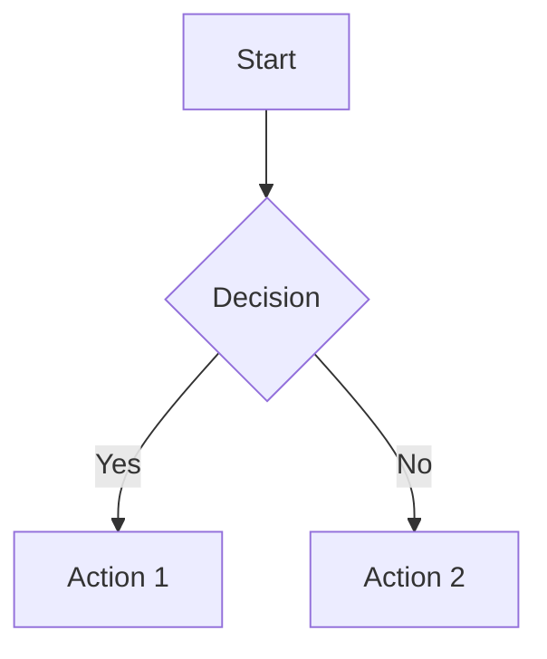

# PACT System Diagrams

This directory contains source files for diagrams used in the PACT System documentation.

## Purpose

While rendered diagrams are stored in the `../images/` directory, this directory contains:

- Source files for diagrams (e.g., drawio, mermaid, plantuml)
- Diagram templates and style guides
- Automation scripts for diagram generation

## Directory Structure

- `architecture/` - System architecture diagram sources
- `flows/` - Process and workflow diagram sources
- `models/` - Data model diagram sources
- `templates/` - Reusable diagram templates
- `scripts/` - Automation scripts for diagram generation

## Diagram Formats and Tools

The PACT System supports the following diagram formats:

### Mermaid.js

For simple diagrams that can be embedded directly in markdown:

### Draw.io / diagrams.net

For more complex diagrams:
- Save source files as `.drawio` or `.drawio.xml`
- Export rendered diagrams to SVG for inclusion in documentation

### PlantUML

For UML diagrams:
- Save source files as `.puml`
- Generate SVG outputs

## Naming Conventions

Please follow these naming conventions for diagram source files:

- Use lowercase
- Use hyphens instead of spaces
- Include a descriptive name
- Include the date (YYYYMMDD) for versioned diagrams

Example: `verification-process-flow-20250515.drawio` 