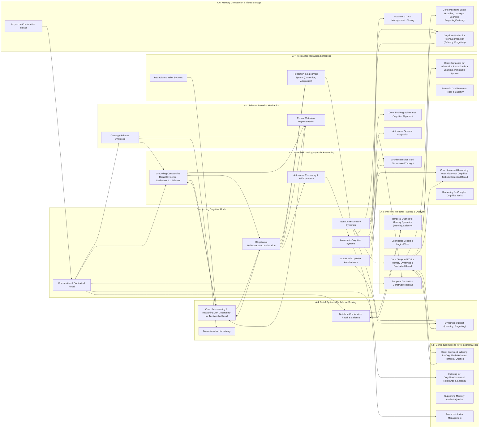

# PACT-System Memory Enhancements: Discussion Agenda & Preparation

This document outlines the agenda for discussing future enhancements to the PACT-System memory, as detailed in `memory/README.md`. It is designed to support a **non-linear, multi-threaded discussion style**, where we can explore interconnected ideas as they arise. For each major topic, it lists key prompts and areas for exploration, all while considering the overarching goal of creating a memory system with advanced cognitive properties.

## Pre-reading / General References:

*   [`memory/README.md`](../../memory/README.md) (especially section 1.5: Future Enhancements and section 1.3 on Implicit Memory Functions)
*   [`docs/plans/future-research/memory_system_enhancements_discussion_log.md`](./memory_system_enhancements_discussion_log.md) (for detailed notes on points 1-4)
*   PACT-S Core Principles documents (e.g., `core/principles.md` or equivalent)
*   Existing PACT-S Schema definitions or notes (e.g., `memory/README.md` Section 2)
*   Existing PACT-S Ontology concepts or drafts (if any, or to be developed in conjunction)

### Overarching Cognitive Goals & Cross-Cutting Concepts:
(These should inform and permeate the discussion of each agenda item, allowing for interleaved exploration)
*   **Non-Linear Memory Dynamics**: Acknowledging that learning, remembering, and forgetting are not linear. Exploring how the system can model or support these dynamics (e.g., variable recall strength, graceful degradation/forgetting, context-dependent learning rates).
*   **Constructive & Contextual Recall**: Moving beyond simple retrieval to how the system can actively construct answers or insights based on stored knowledge, highly tuned to the specific context of a query or situation. This involves understanding and modeling contextual relevancy (saliency).
*   **Mitigation of Hallucination/Confabulation**: Ensuring that any constructive recall or inferential processes are grounded, transparent, and include mechanisms (e.g., confidence scoring, evidence tracking, derivation paths) to distinguish well-supported information from speculation, thereby minimizing the risk of generating false or misleading information.
*   **Autonomic Cognitive Systems**: Exploring self-managing, self-optimizing, and self-correcting properties for memory and reasoning (e.g., "autonomic relational memory," "autonomic logical check-checking").
*   **Advanced Cognitive Architectures**: Drawing inspiration from concepts like "parallelism and chain-of-multi-dimensional thought" and "multi-cameral mind" for modular, introspective, and multi-perspective reasoning and memory access.

---

## Agenda Item 1: Schema Evolution Mechanics

*   **Core Idea**: Formalize how the schema (definitions of entity types, attributes, etc.) can evolve to support an increasingly sophisticated and cognitively-aligned knowledge graph, maintaining integrity and historical consistency (a la Datomic).
*   **Prompts for Multi-threaded Exploration**:
    *   **Ontology-Schema Symbiosis**: How do we ensure the PACT-S ontology and its schema co-evolve harmoniously to support advanced cognitive functions? What mechanisms facilitate this interplay, especially for representing concepts like context, evidence, derivation paths crucial for constructive, non-confabulatory recall?

        ```mermaid
        graph TD
            A[Ontology] -- Defines & Guides --> B(Schema);
            B -- Enables Representation --> C["Cognitive Concepts (Context, Evidence, Derivation, Saliency)"];
            A -- Evolves --> A_New[Evolved Ontology];
            B -- Evolves --> B_New[Evolved Schema];
            A_New --> B_New;
            C -- Crucial For --> D[Constructive Recall];
            D -- Aims For --> E[Non-Confabulatory Recall];
            F[Advanced Cognitive Functions] -- Relies On --> B_New;
            F -- Informs --> A_New;
            B_New -- Must Support --> F;
            G[Overarching Cognitive Goals] -. Guides .-> A_New;
            G -. Guides .-> B_New;
            H[Robust Metadata Representation] -. Achieved Via .-> B_New;
            I[Formalizing Schema Evolution] -. Manages Changes To .-> B
        ```

    *   **Robust Metadata Representation**: What schema constructs are vital for capturing the rich metadata needed for non-linear recall, contextual saliency determination, tracing information construction (to mitigate confabulation), and representing autonomic control mechanisms? How do these constructs evolve with the system's understanding?

        ```mermaid
        graph TD
            A[Schema Constructs] -- Vital For --> B(Rich Metadata);
            B -- Enables --> C[Non-Linear Recall];
            B -- Enables --> D[Contextual Saliency Determination];
            B -- Enables --> E[Tracing Information Construction];
            E -- Mitigates --> F[Confabulation];
            B -- Enables --> G[Autonomic Control Mechanisms];
            A -- Evolves With --> H[System Understanding];
            H -- Informed By --> I[Overarching Cognitive Goals];
            A -- Part Of --> J[Schema Evolution Mechanics];
            K[Ontology-Schema Symbiosis] -- Defines Needs For --> A;
            L[Advanced Cognitive Functions] -- Require --> B
        ```

    *   **Formalizing Schema Evolution**: What processes (versioning, impact analysis on cognitive functions, change management) are necessary for evolving the schema, especially considering its impact on ongoing cognitive functions and historical data interpretation relevant to cognitive processes?

        ```mermaid
        graph TD
            A[Schema Evolution] -- Requires Formal Processes --> B(Formalization);
            B --> C[Versioning];
            B --> D[Impact Analysis];
            D -- Considers --> E[Ongoing Cognitive Functions];
            D -- Considers --> F[Historical Data Interpretation];
            F -- Relevant To --> G[Cognitive Processes];
            B --> H[Change Management];
            A -- Impacts --> E;
            A -- Impacts --> F;
            I[Technical Underpinnings] -- Influence --> B;
            J[PACT-S Principles] -- Guide --> B;
            K[Overarching Cognitive Goals] -- Shape --> D;
        ```

    *   **Technical Underpinnings & Historical Integrity**: What are the implications of technical choices (e.g., schema-as-data vs. traditional versioning) on the agility and integrity of schema evolution, particularly for supporting historical queries that trace how information or understanding was constructed at a specific past time T?

        ```mermaid
        graph TD
            A["Technical Choices (Schema-as-Data vs. Traditional Versioning)"] -- Impact --> B(Agility of Schema Evolution);
            A -- Impact --> C(Integrity of Schema Evolution);
            A -- Support --> D[Historical Queries];
            D -- Trace --> E["Information/Understanding Construction (at Time T)"];
            C -- EssentialFor --> D;
            F[Schema Evolution Mechanics] -- Incorporates --> A;
            G[Formalizing Schema Evolution] -- Guides --> A;
            H[Overarching Cognitive Goals] -- Requires --> E;
            I[Temporal Tracking] -- Enables --> D;
        ```

    *   **PACT-S Principles in Evolution**: How do we ensure schema evolution processes and outcomes remain transparent, accountable, and clearly supportive of PACT-S cognitive claims and the mitigation of confabulation?

        ```mermaid
        graph TD
            A[Schema Evolution Processes & Outcomes] -- Must Adhere To --> B(PACT-S Principles);
            B --> C[Transparency];
            B --> D[Accountability];
            B --> E[Clarity];
            A -- Must Support --> F[PACT-S Cognitive Claims];
            A -- Must Support --> G[Mitigation of Confabulation];
            C -- Ensures --> F_Support[Support for F Visible];
            D -- Ensures --> F_Trace[Traceability for F];
            G -- Depends On --> C;
            G -- Depends On --> D;
            H[Formalizing Schema Evolution] -- Implements --> A;
            I[Overarching Cognitive Goals] -- Drive Need For --> F;
            I -- Drive Need For --> G;
        ```

    *   **Autonomic Schema Adaptation**: What role can autonomic processes play in suggesting or managing schema adaptations based on system learning, data patterns, observed cognitive performance (e.g., in recall or reasoning), or the evolving needs of constructive recall strategies?

        ```mermaid
        graph TD
            A[Autonomic Processes] -- Role In --> B(Schema Adaptation);
            B -- Based On --> C[System Learning];
            B -- Based On --> D[Data Patterns];
            B -- Based On --> E["Observed Cognitive Performance (Recall, Reasoning)"];
            B -- Based On --> F[Evolving Needs of Constructive Recall Strategies];
            A -- SuggestsOrManages --> B;
            G[Schema Evolution Mechanics] -- May Incorporate --> A;
            H[Overarching Cognitive Goals] -- (Autonomic Cognitive Systems) Motivates --> A;
            I[Robust Metadata Representation] -- (Evolving Constructs) Links To --> F;
        ```
*   **References/Information Needed**: `memory/README.md` (Sec 1.5.1), `memory_system_enhancements_discussion_log.md` (Sec 1), Datomic schema evolution, best practices in ontology-driven schema design for KGs aimed at AI.

---

## Agenda Item 2: Inherent Temporal Tracking & Querying

*   **Core Idea**: Leverage immutable fact logs and transaction IDs for robust temporal querying, foundational for understanding memory dynamics (learning, forgetting, saliency changes) and providing rich context for recall.
*   **Prompts for Multi-threaded Exploration**:
    *   **Representing Time for Cognitive Processes**: How can bitemporal models (transaction vs. valid time) and "logical time points" (linked to events, contexts, `RecallTag`s) accurately represent the history needed for truthful, context-aware constructive recall and modeling memory dynamics?

        ```mermaid
        graph TD
            A[Temporal Models] -- Includes --> B(Bitemporal Models: Tx Time, Valid Time);
            A -- Includes --> C(Logical Time Points: Events, Contexts, RecallTags);
            B -- Enables AccurateRepresentationOf --> D[Historical States];
            C -- StructuresQueriesAround --> E[Meaningful Temporal Contexts];
            D & E -- CrucialFor --> F[Truthful Constructive Recall];
            F -- Addresses --> G[Mitigation of Confabulation];
            D & E -- SupportModelingOf --> H[Non-Linear Memory Dynamics];
            I[Overarching Cognitive Goals] -. Underpins .-> F;
            I -. Underpins .-> H;
            J[Temporal Queries for Memory Dynamics] -. Leverages .-> A;
        ```

    *   **Temporal Queries for Memory Dynamics**: What query language extensions are needed to reason about rates of change, stability of information, learning curves, forgetting patterns, and evolving saliency, supporting a non-linear view of memory?

        ```mermaid
        graph TD
            A[Query Language Extensions] -- EnableReasoningAbout --> B(Memory Dynamics Information);
            B --> C[Rates of Change];
            B --> D[Stability of Information];
            B --> E[Learning Curves];
            B --> F[Forgetting Patterns];
            B --> G[Evolving Saliency];
            A -- Support --> H[Non-Linear View of Memory];
            H -- AlignsWith --> I[Overarching Cognitive Goal: Non-Linear Memory Dynamics];
            J[Representing Time for Cognitive Processes] -- InformsNeedFor --> A;
            K[Contextual Indexing] -- Optimizes --> A;
        ```

    *   **Temporal Context in Constructive Recall**: How does rich temporal data provide the necessary context for advanced constructive recall, and how does it interact with schema evolution when reconstructing past derivation paths or contexts?

        ```mermaid
        graph TD
            A[Rich Temporal Data] -- Provides --> B(Necessary Context);
            B -- EssentialFor --> C[Advanced Constructive Recall];
            C -- Mitigates --> D[Confabulation];
            A -- InteractsWith --> E[Schema Evolution];
            E -- Affects --> F[Reconstruction of Past Derivation Paths/Contexts];
            C -- Leverages --> F;
            G[Overarching Cognitive Goal: Constructive & Contextual Recall] -- ReliesOn --> B;
            H[Inherent Temporal Tracking] -- Supplies --> A;
        ```

    *   **Modeling Saliency Over Time**: How can temporal tracking contribute to models of information saliency that change based on recency, frequency, contextual relevance, and evidence strength, influencing non-linear recall?

        ```mermaid
        graph TD
            A[Temporal Tracking] -- ContributesTo --> B(Models of Information Saliency);
            B -- ChangesBasedOn --> C[Recency];
            B -- ChangesBasedOn --> D[Frequency];
            B -- ChangesBasedOn --> E[Contextual Relevance];
            B -- ChangesBasedOn --> F[Evidence Strength];
            B -- Influences --> G[Non-Linear Recall];
            G -- AlignsWith --> H[Overarching Cognitive Goal: Non-Linear Memory Dynamics];
            I[Overarching Cognitive Goal: Constructive & Contextual Recall] -- Requires --> B;
            J[Belief Systems/Confidence Scoring] -- Provides --> F;
        ```

*   **References/Information Needed**: `memory/README.md` (Sec 1.5.2), `memory_system_enhancements_discussion_log.md` (Sec 2), temporal database literature, `RecallTag` concept.

---

## Agenda Item 3: Advanced Datalog/Symbolic Reasoning

*   **Core Idea**: Extend query and inference capabilities (Datalog, other symbolic engines) to operate over the historical fact log, enabling complex event processing, causal analysis, temporal pattern detection, and sophisticated, grounded constructive recall.
*   **Prompts for Multi-threaded Exploration**:
    *   **Reasoning for Cognitive Tasks**: Which Datalog/symbolic features (recursion, negation, aggregation, temporal extensions) are paramount for supporting complex cognitive tasks like multi-step inference, pathfinding for derivations, exception handling in recall, and recognizing dynamic patterns indicative of learning or context change?

        ```mermaid
        graph TD
            A[Datalog/Symbolic Features] -- Support --> B(Complex Cognitive Tasks);
            A --> A1[Recursion for Pathfinding/Derivation];
            A --> A2[Negation for Exception Handling];
            A --> A3[Aggregation for Summarization];
            A --> A4[Temporal Extensions for Dynamic Patterns];
            B --> B1[Multi-Step Inference];
            B --> B2["Pattern Recognition (Learning/Context Change)"];
            B -- RelatesTo --> C[Overarching Cognitive Goal: Constructive & Contextual Recall];
            D[Advanced Datalog/Symbolic Reasoning] -- Employs --> A;
        ```

    *   **Architectures for Multi-Dimensional Thought**: How can diverse reasoners be integrated to mimic aspects of multi-dimensional thought or a "multi-cameral mind"? How are their interactions, potential conflicts, and varying perspectives managed to contribute to robust constructive recall without confabulation?

        ```mermaid
        graph TD
            A[Diverse Reasoners] -- Integration --> B(Cognitive Architecture);
            B -- Mimics --> C[Multi-Dimensional Thought];
            B -- InspiredBy --> D[Multi-Cameral Mind Concept];
            B -- Manages --> E[Reasoner Interactions];
            B -- Manages --> F[Potential Conflicts];
            B -- Manages --> G[Varying Perspectives];
            B -- AimsToContributeTo --> H[Robust Constructive Recall];
            H -- Avoids --> I[Confabulation];
            J[Overarching Cognitive Goals] -. Shape .-> B;
        ```

    *   **Grounding Constructive Recall**: How can symbolic reasoning mechanisms (e.g., analogy, abduction, rule-based inference) be employed for constructive recall while ensuring inferences are rigorously grounded in evidence, derivation paths are transparent, and confidence is appropriately handled to mitigate hallucination?

        ```mermaid
        graph TD
            A[Symbolic Reasoning Mechanisms (Analogy, Abduction, Rules)] -- EmployedFor --> B(Constructive Recall);
            B -- MustBeGroundedIn --> C[Evidence];
            B -- RequiresTransparent --> D[Derivation Paths];
            B -- RequiresAppropriateHandlingOf --> E[Confidence];
            C & D & E -- HelpMitigate --> F[Hallucination/Confabulation];
            G[Overarching Cognitive Goal: Mitigation of Hallucination] -- AddressedBy --> F;
            H[Belief Systems] -- Provides --> E;
            I[Schema] -- Represents --> D;
            I -- Represents --> C;
        ```

    *   **Autonomic Reasoning & Self-Correction**: What does it mean to design for "autonomic" reasoning? How can the system perform logical "check-checking," meta-reason about inference quality, or self-correct based on new evidence, feedback, or detected inconsistencies, especially in complex chains of thought?

        ```mermaid
        graph TD
            A[Autonomic Reasoning Design] -- Enables --> B[Logical Check-Checking];
            A -- Enables --> C[Meta-Reasoning on Inference Quality];
            A -- Enables --> D[Self-Correction];
            D -- BasedOn --> E[New Evidence];
            D -- BasedOn --> F[Feedback];
            D -- BasedOn --> G[Detected Inconsistencies];
            A -- ImportantFor --> H[Complex Chains of Thought];
            I[Overarching Cognitive Goal: Autonomic Cognitive Systems] -- Embodies --> A;
            J[Advanced Datalog/Symbolic Reasoning] -- AspiresTo --> A;
        ```

    *   **Event Abstraction for Narratives**: How can an event ontology and abstraction mechanisms transform raw data changes into meaningful events for reasoning about processes, narratives, and the evolution of understanding?

        ```mermaid
        graph TD
            A[Event Ontology & Abstraction Mechanisms] -- Transform --> B(Raw Data Changes);
            B -- Into --> C[Meaningful Events];
            C -- EnableReasoningAbout --> D[Processes];
            C -- EnableReasoningAbout --> E[Narratives];
            C -- EnableReasoningAbout --> F[Evolution of Understanding];
            G[Overarching Cognitive Goals] -- SupportedBy --> F;
            H[Temporal Tracking] -- Provides --> B;
            I[Advanced Datalog/Symbolic Reasoning] -- Leverages --> C;
        ```

*   **References/Information Needed**: `memory/README.md` (Sec 1.5.3), `memory_system_enhancements_discussion_log.md` (Sec 3), `CausalAssertion` details, literature on Datalog, CEP, symbolic AI, cognitive architectures.

---

## Agenda Item 4: Belief Systems/Confidence Scoring (as facts)

*   **Core Idea**: Explicitly represent belief, confidence, and alternative hypotheses as facts within the KG, allowing the system to track, reason about uncertainty, and manage the provenance of constructed knowledge to ensure trustworthy recall.
*   **Prompts for Multi-threaded Exploration**:
    *   **Representing & Reasoning with Nuance**: Which formalisms for uncertainty (Bayesian, Dempster-Shafer, etc.) best support nuanced belief representation, propagation of confidence, and their role in mitigating hallucination during constructive recall? How is this reflected in the schema to ensure transparency of construction?

        ```mermaid
        graph TD
            A["Formalisms for Uncertainty (Bayesian, Dempster-Shafer, etc.)"] -- Support --> B(Nuanced Belief Representation);
            A -- Support --> C(Propagation of Confidence);
            B & C -- RoleIn --> D[Mitigating Hallucination];
            D -- During --> E[Constructive Recall];
            F[Schema] -- ReflectsUseOf --> A;
            F -- Ensures --> G[Transparency of Construction];
            H[Overarching Cognitive Goal: Mitigation of Hallucination] -- CentralTo --> D;
            I[Belief Systems/Confidence Scoring] -- Leverages --> A;
        ```

    *   **Beliefs in Constructive Recall & Saliency**: How do explicit belief systems and confidence scores contribute to managing constructive recall, distinguishing well-grounded information from hypotheses, informing saliency (e.g., high confidence/strong evidence = more salient), and actively mitigating confabulation?

        ```mermaid
        graph TD
            A[Explicit Belief Systems & Confidence Scores] -- ContributeTo --> B(Managing Constructive Recall);
            A -- Enable --> C[Distinguishing Grounded Info from Hypotheses];
            A -- Inform --> D[Saliency (High Confidence/Evidence -> More Salient)];
            A -- ActivelyMitigate --> E[Confabulation];
            B & C & D & E -- Support --> F[Overarching Cognitive Goals (Trustworthy Recall, Non-Linear Dynamics)];
            G[Schema Evolution] -- MustSupport --> A;
        ```

    *   **Dynamics of Belief & Learning**: How do belief revision, confidence decay/updates, and the tracking of epistemic shifts reflect non-linear learning and forgetting? How are conflicts between beliefs (perhaps from different "cameras" of a multi-cameral architecture) resolved or maintained?

        ```mermaid
        graph TD
            A[Belief Dynamics] -- Reflect --> B(Non-Linear Learning/Forgetting);
            A --> A1[Belief Revision (AGM Postulates etc.)];
            A --> A2[Confidence Decay/Updates];
            A --> A3[Tracking Epistemic Shifts];
            C[Conflict Resolution/Maintenance] -- ForBeliefsFrom --> D(Multiple Sources/Perspectives e.g. Multi-Cameral Mind);
            A & C -- KeyComponentsOf --> E[Advanced Cognitive Architectures];
            F[Temporal Tracking] -- Enables --> A2;
            F -- Enables --> A3;
        end
        ```

    *   **Ethical AI**: How can the system responsibly represent and reason about potentially sensitive or user-related beliefs, ensuring clarity and fairness in its cognitive processes?

        ```mermaid
        graph TD
            A[Belief Systems] -- Raise --> B(Ethical Considerations);
            B -- EspeciallyFor --> C[Sensitive/User-Related Beliefs];
            A -- MustEnsure --> D[Responsible Representation];
            A -- MustEnsure --> E[Responsible Reasoning];
            D & E -- Uphold --> F[Clarity in Cognitive Processes];
            D & E -- Uphold --> G[Fairness in Cognitive Processes];
            H[PACT-S Principles] -- MustGuide --> D;
            H -- MustGuide --> E;
            I[Overarching Cognitive Goals] -- (Trustworthy AI) DependsOn --> D & E;
        ```

*   **References/Information Needed**: `memory/README.md` (Sec 1.5.4), `memory_system_enhancements_discussion_log.md` (Sec 4), `ObservationRecord`, `CausalAssertion` schemas, literature on uncertainty in AI.

---

## Agenda Item 5: Contextual Indexing for Temporal Queries

*   **Core Idea**: Optimize indexing to efficiently support the demanding temporal queries and traversals crucial for context-aware, constructive recall and analyzing non-linear memory dynamics.
*   **Prompts for Multi-threaded Exploration**:
    *   **Indexing for Cognitive Relevance**: What indexing strategies best support rapid retrieval of contextually relevant information for dynamic, constructive recall, especially considering factors that influence saliency (temporality, associations, confidence, query context)?

        ```mermaid
        graph TD
            A[Indexing Strategies] -- Support --> B(Rapid Retrieval of Contextually Relevant Info);
            B -- For --> C[Dynamic Constructive Recall];
            A -- ConsiderFactors --> D[Saliency Factors];
            D --> D1[Temporality];
            D --> D2[Associations];
            D --> D3[Confidence];
            D --> D4[Query Context];
            C -- AidedBy --> D;
            E[Overarching Cognitive Goal: Constructive & Contextual Recall] -- Requires --> A;
            F[Non-Linear Memory Dynamics] -- InfluencesDesignOf --> A;
        ```

    *   **Supporting Memory Analysis**: How can indexing facilitate diverse temporal query types needed for understanding memory evolution, non-linear learning/forgetting patterns, and context shifts?

        ```mermaid
        graph TD
            A[Indexing] -- Facilitates --> B(Diverse Temporal Query Types);
            B -- NeededForUnderstanding --> C[Memory Evolution];
            B -- NeededForUnderstanding --> D[Non-Linear Learning/Forgetting Patterns];
            B -- NeededForUnderstanding --> E[Context Shifts];
            C & D & E -- Inform --> F[Overarching Cognitive Goals (Non-Linear Dynamics, Constructive Recall)];
            G[Inherent Temporal Tracking] -- ProvidesDataFor --> B;
        end
        ```

    *   **Autonomic Index Management for Recall**: What role can autonomic processes play in managing and optimizing indexes based on observed query patterns, saliency models, and the evolving needs of constructive recall to ensure continued efficiency?

        ```mermaid
        graph TD
            A[Autonomic Processes] -- RoleIn --> B(Managing & Optimizing Indexes);
            B -- BasedOn --> C[Observed Query Patterns];
            B -- BasedOn --> D[Saliency Models];
            B -- BasedOn --> E[Evolving Needs of Constructive Recall];
            B -- Ensures --> F[Continued Efficiency of Recall];
            G[Overarching Cognitive Goal: Autonomic Cognitive Systems] -- Motivates --> A;
            H[Contextual Indexing] -- EnhancedBy --> A;
        end
        ```

*   **References/Information Needed**: `memory/README.md` (Sec 1.5.5), research on temporal/graph indexing, KG backend documentation.

---

## Agenda Item 6: Memory Compaction & Tiered Storage (Conceptual)

*   **Core Idea**: Explore strategies for managing large historical fact logs (compaction, tiered storage) while ensuring queryability, potentially linking these mechanisms to cognitive concepts of forgetting, information saliency, and efficient constructive recall.
*   **Prompts for Multi-threaded Exploration**:
    *   **Cognitive Models for Tiering/Compaction**: How can memory tiering and compaction strategies be informed by models of non-linear forgetting or information saliency (e.g., moving less salient, less contextually central, or less frequently recalled/constructed data to slower tiers)?

        ```mermaid
        graph TD
            A[Memory Tiering/Compaction Strategies] -- InformedBy --> B(Cognitive Models);
            B --> B1[Non-Linear Forgetting];
            B --> B2[Information Saliency];
            A -- Action:MoveDataToSlowerTiers --> C[Less Salient/Central/Recalled Data];
            D[Overarching Cognitive Goal: Non-Linear Memory Dynamics] -- Influences --> B;
            E[Autonomic Data Management] -- Implements --> A;
        ```

    *   **Impact on Constructive Recall**: What is the impact on the system's ability to perform rich, constructive recall if some underlying information is less readily accessible due to tiering? How can this be managed to avoid degrading cognitive performance or introducing bias?

        ```mermaid
        graph TD
            A[Tiered Storage (Less Accessible Info)] -- ImpactsAbilityToPerform --> B(Rich Constructive Recall);
            B -- PotentialDegradationOf --> C[Cognitive Performance];
            B -- PotentialIntroductionOf --> D[Bias];
            E[ManagementStrategies] -- AimToAvoid --> C;
            E -- AimToAvoid --> D;
            F[Overarching Cognitive Goal: Constructive & Contextual Recall] -- MustBePreservedDespite --> A;
            G[Queryability Across Tiers] -- IsAKey --> E;
        ```

    *   **Autonomic Data Management**: How can autonomic systems manage data tiering and compaction based on dynamic saliency, recall patterns, and the overall goal of maintaining efficient and effective cognitive functions?

        ```mermaid
        graph TD
            A[Autonomic Systems] -- Manage --> B(Data Tiering & Compaction);
            B -- BasedOn --> C[Dynamic Saliency];
            B -- BasedOn --> D[Recall Patterns];
            B -- Goal:Maintain --> E[Efficient Cognitive Functions];
            B -- Goal:Maintain --> F[Effective Cognitive Functions];
            G[Overarching Cognitive Goal: Autonomic Cognitive Systems] -- EmbodiedBy --> A;
            H[Cognitive Models for Tiering/Compaction] -- Inform --> C & D;
        end
        ```

*   **References/Information Needed**: `memory/README.md` (Sec 1.5.6), literature on large-scale data tiering, Datomic storage management.

---

## Agenda Item 7: Formalized Retraction Semantics

*   **Core Idea**: Define clear semantics for how information is "retracted" or superseded in an immutable system, considering its impact on learning, belief revision, constructive recall, and the overall integrity of a cognitively advanced memory.
*   **Prompts for Multi-threaded Exploration**:
    *   **Retraction in a Learning System**: What is the conceptual model of "retraction" (marking, negating, archiving) and what is its role in a system that must learn, adapt, and correct its knowledge base to support accurate constructive recall and avoid persistent confabulation?

        ```mermaid
        graph TD
            A["Conceptual Model of Retraction (Marking, Negating, Archiving)"] -- RoleIn --> B(Learning System);
            B -- Must --> BA[Learn];
            B -- Must --> BB[Adapt];
            B -- Must --> BC[Correct Knowledge Base];
            BC -- Supports --> D[Accurate Constructive Recall];
            BC -- Avoids --> E[Persistent Confabulation];
            F["Overarching Cognitive Goals (Non-Linear Memory, Constructive Recall, Mitigation of Confabulation)"] -- Require --> A;
        ```

    *   **Retraction's Influence on Recall & Saliency**: How does information retraction interact with learning processes and the dynamics of constructive recall (e.g., "unlearning" patterns, revising previously constructed knowledge/beliefs, updating saliency based on new, superseding information)?

        ```mermaid
        graph TD
            A[Information Retraction] -- InteractsWith --> B(Learning Processes);
            A -- InteractsWith --> C(Dynamics of Constructive Recall);
            C --> C1[Unlearning Patterns];
            C --> C2[Revising Constructed Knowledge/Beliefs];
            C --> C3[Updating Saliency based on New Info];
            D[Non-Linear Memory Dynamics] -- ManifestsIn --> C1 & C2 & C3;
            E[Formalized Retraction Semantics] -- Governs --> A;
        ```

    *   **Retraction and Beliefs**: How does retracting a piece of information interact with associated beliefs, confidence scores, or its role as evidence for other hypotheses? Is a retracted fact simply gone, or does its past influence (and the reasons for its retraction) remain part of the system's understanding?

        ```mermaid
        graph TD
            A[Retracting Information] -- InteractsWith --> B(Associated Beliefs);
            A -- InteractsWith --> C(Confidence Scores);
            A -- InteractsWith --> D(Role as Evidence for Hypotheses);
            E{Retracted Fact Status} -- Question --> F[Simply Gone?];
            E -- Question --> G[Past Influence & Reasons for Retraction Remain?];
            G -- ImportantFor --> H[System Understanding & Auditability];
            I[Belief Systems] -- AffectedBy --> A;
            J[Temporal Tracking] -- RecordsHistoryOf --> A;
            K[Overarching Cognitive Goal: Mitigation of Confabulation] -- RequiresClarityOn --> E;
        ```

*   **References/Information Needed**: `memory/README.md` (Sec 1.5.7), literature on negation/retraction in KR, belief revision.

---

Please review this updated agenda. The goal is to ensure our_detailed technical discussions are consistently informed by the broader cognitive aspirations for the PACT-System memory, allowing for a flexible and rich exploration. We can adjust further or proceed to Agenda Item 1. 